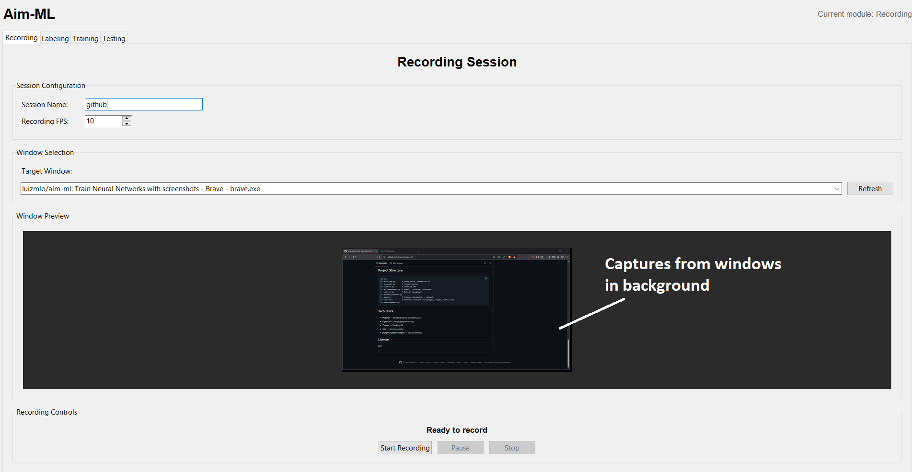
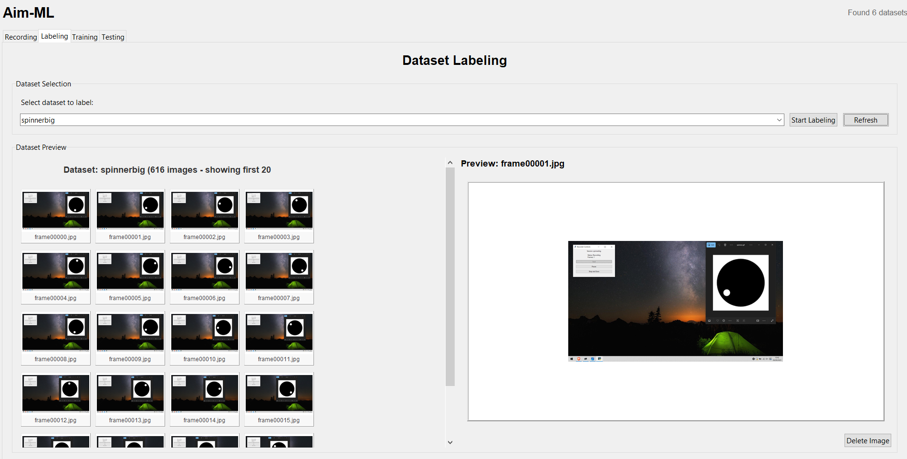
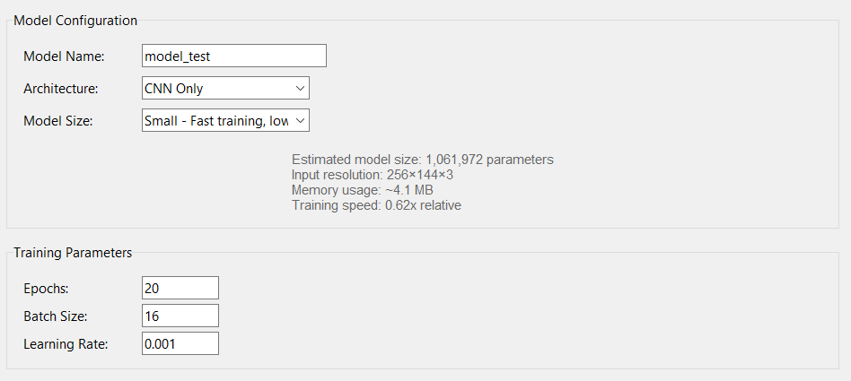
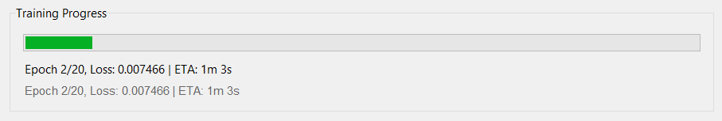
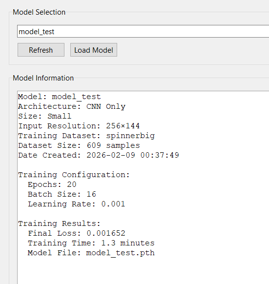
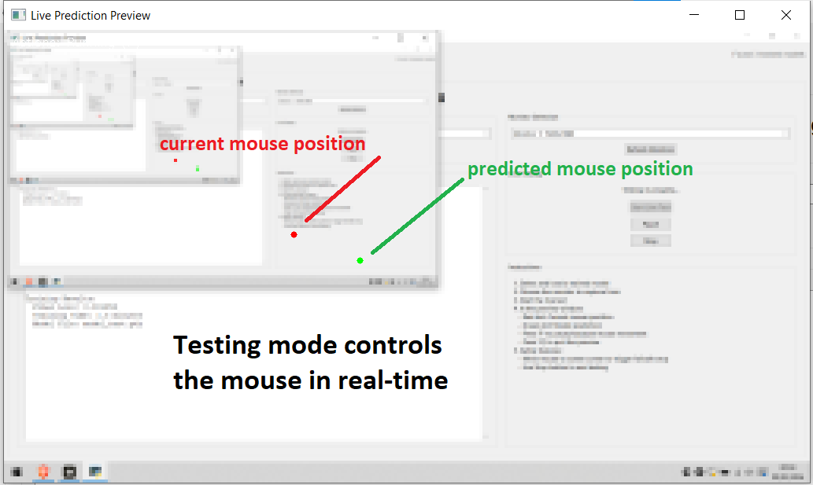

# Aim-ML

A desktop application for training and deploying neural networks that predict screen coordinates from live screen capture. Built for gaze-tracking, cursor prediction, and similar spatial regression tasks.


## Features

- **Record** — Capture screen frames from a target window or whole screen at configurable FPS
- **Label** — Interactive GUI for annotating click coordinates on each frame
- **Train** — Multiple model architectures (CNN, RNN, LSTM, GRU, Vision Transformer) with dynamic sizing
- **Test** — Live inference with real-time mouse control and optional failsafe

## Screenshots

**Recording** — Select a window and capture frames



**Labeling** — Annotate target coordinates on each frame



**Training** — Configure architecture, size, and monitor progress




**Testing** — Load a model and run live prediction




## Architecture

The app uses a modular pipeline:

| Module | Purpose |
|--------|---------|
| `recorder.py` | Screen capture via Windows API or mss |
| `labeler.py` | Tkinter GUI for frame-by-frame labeling |
| `ml_components.py` | Model definitions, training, and live inference |
| `main_app.py` | Integrated tabbed interface |

**Supported model types:**
- CNN Only, RNN Only
- CNN + RNN / LSTM / GRU
- Vision Transformer

Models output normalized `(x, y)` coordinates in `[0, 1]` for spatial prediction.

## Quick Start

### Prerequisites

- Python 3.10+
- Windows (for window capture; screen capture works cross-platform)

### Installation

```bash
git clone https://github.com/yourusername/aim-ml.git
cd aim-ml
pip install -r requirements.txt
```

### Run

```bash
python main_app.py
```

### Workflow

1. **Recording** — Name a session, select a window, start recording. Frames are saved to `datasets/<session>/raw_images/`.
2. **Labeling** — Open the Labeling tab, pick the session, and click to mark target coordinates on each frame.
3. **Training** — Choose a dataset, model architecture (e.g. CNN+LSTM), and size. Train to produce a `.pth` checkpoint.
4. **Testing** — Load a model, select a monitor, and run live prediction. Press `P` to pause, `Q` to quit.

## Project Structure

```
aim-ml/
├── main_app.py       # Entry point, integrated UI
├── recorder.py       # Screen capture
├── labeler.py        # Labeling GUI
├── ml_components.py  # Models, training, inference
├── dataset.py        # Dataset management
├── window_selector.py
├── models/           # Trained checkpoints + metadata
├── datasets/         # Recorded sessions (raw_images, images, labels.csv)
└── requirements.txt
```

## Tech Stack

- **PyTorch** — Model training and inference
- **OpenCV** — Image preprocessing
- **Tkinter** — Desktop UI
- **mss** — Screen capture
- **pynput / pydirectinput** — Input handling

## License

MIT
